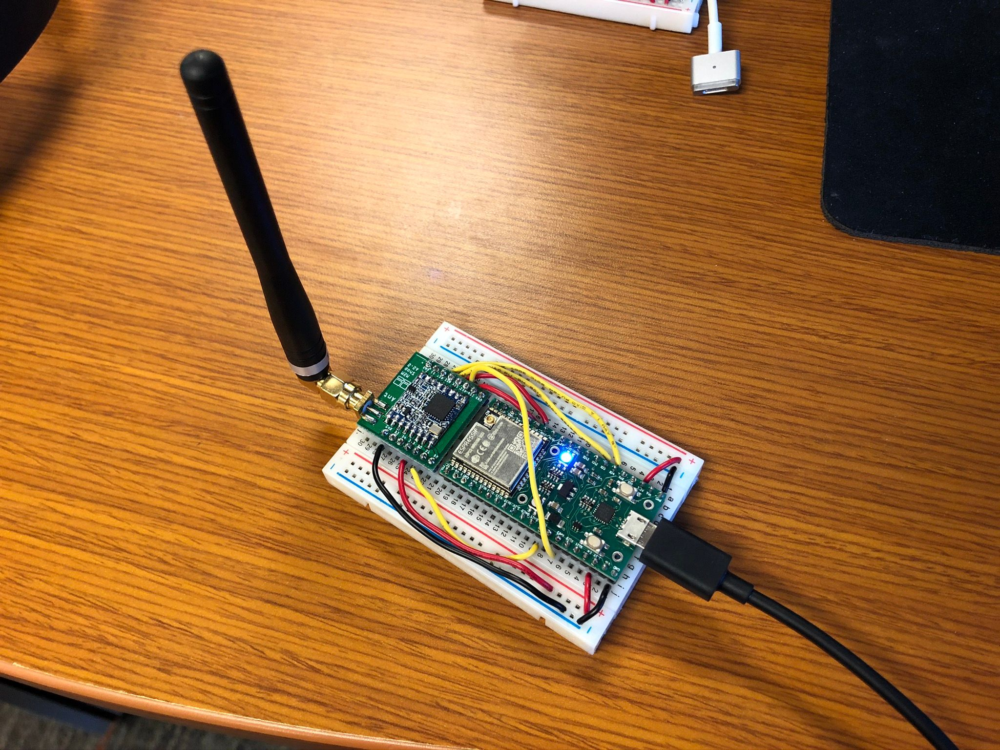

# esp32-lora-reciever

## About

Listens for LoRa packets. Prints them out to Serial.

### Hardware

- [ezsbc esp32](https://www.ezsbc.com/index.php/featured-products-list-home-page/wifi01-35.html)
- [RFM95 915Mhz](https://www.tindie.com/products/m2m/lora-module-for-breadboard-with-antenna/)

