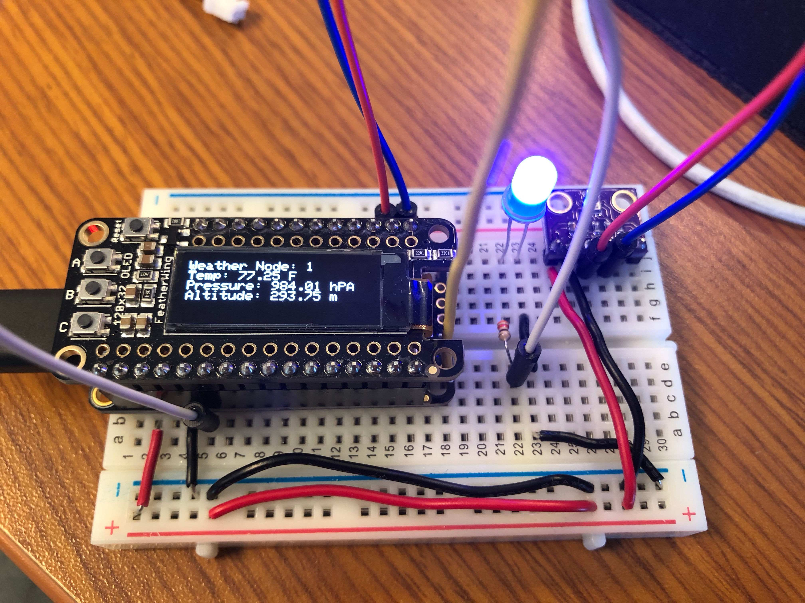

# m0-lora-weather-sensor

## About

Reads BMP280 sensor, sends data via LoRa packet. Blue LED blinks when packet is sent.

Uses ported FreeRTOS for tasks

### Hardware

- [Adafruit Feather M0 with RFM95 (900MHz)](https://www.adafruit.com/product/3178)
- [Adafruit Featherwing OLED](https://www.adafruit.com/product/2900)
- BMP280 (Generic eBay)

